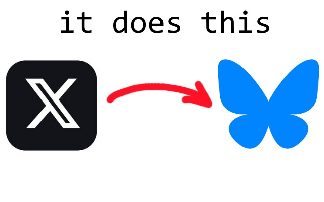

# twt2bsky

redirects you from twitter/x links to bsky.app

uses manifest v3 so that there is no actual code or js, just redirect rules in json, i think this is
as simple as i could make it, with as specific permissions as possible. there is purposely no 'override'
as i wanted to make it annoying to undo, but the extension can always be uninstalled or disabled

### cache

browser caching, including possibly the HSTS cache mean that when first installing this extension it
might not work for certain x or twitter links, in incognito or after enough time passes it should
redirect just fine